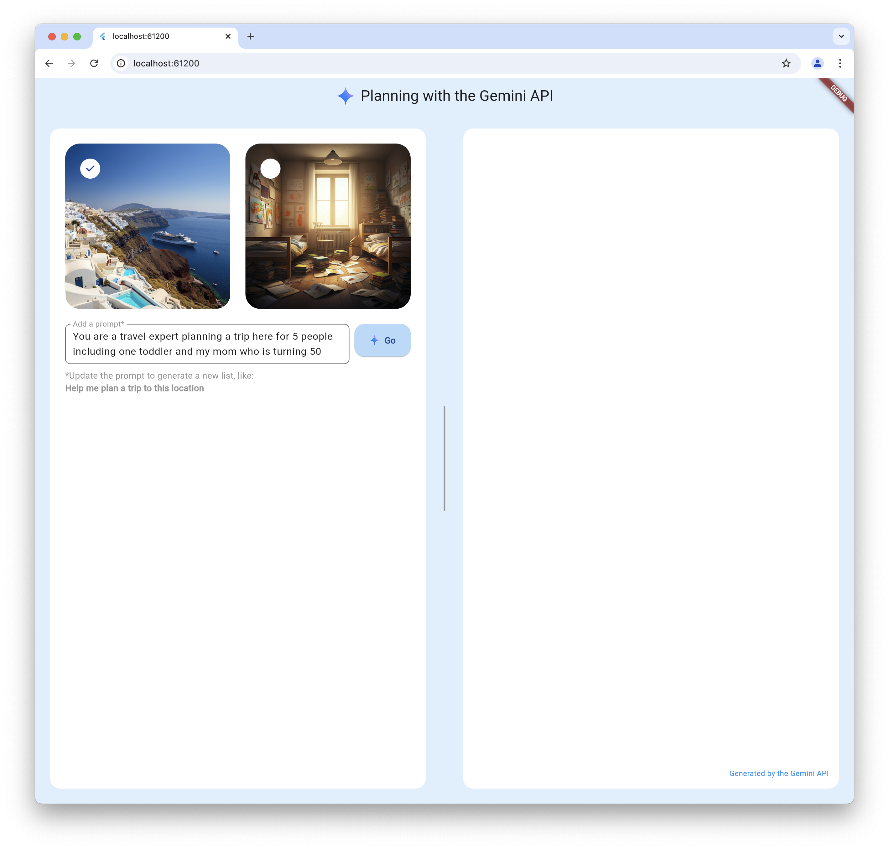
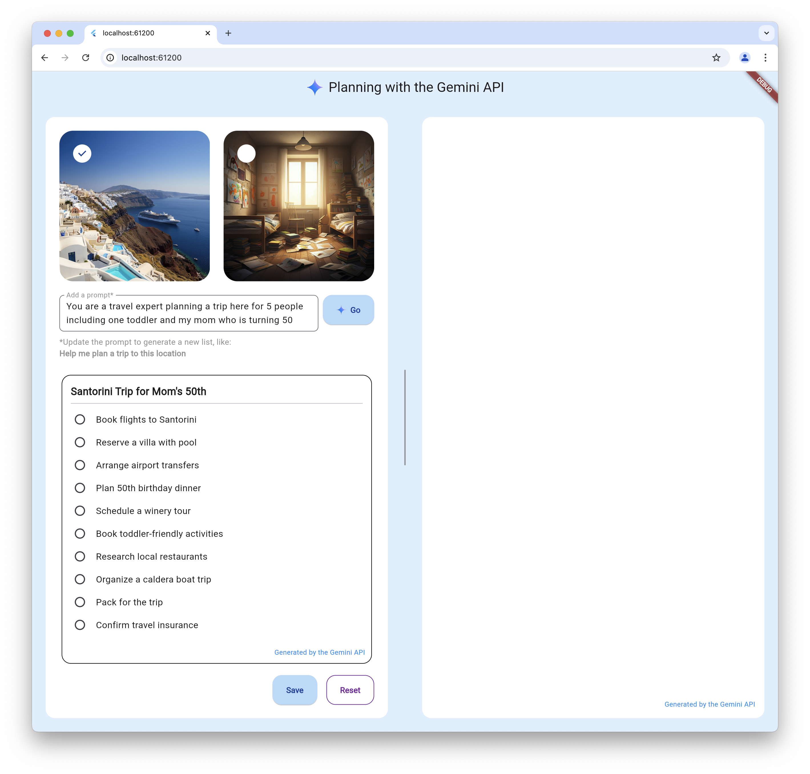
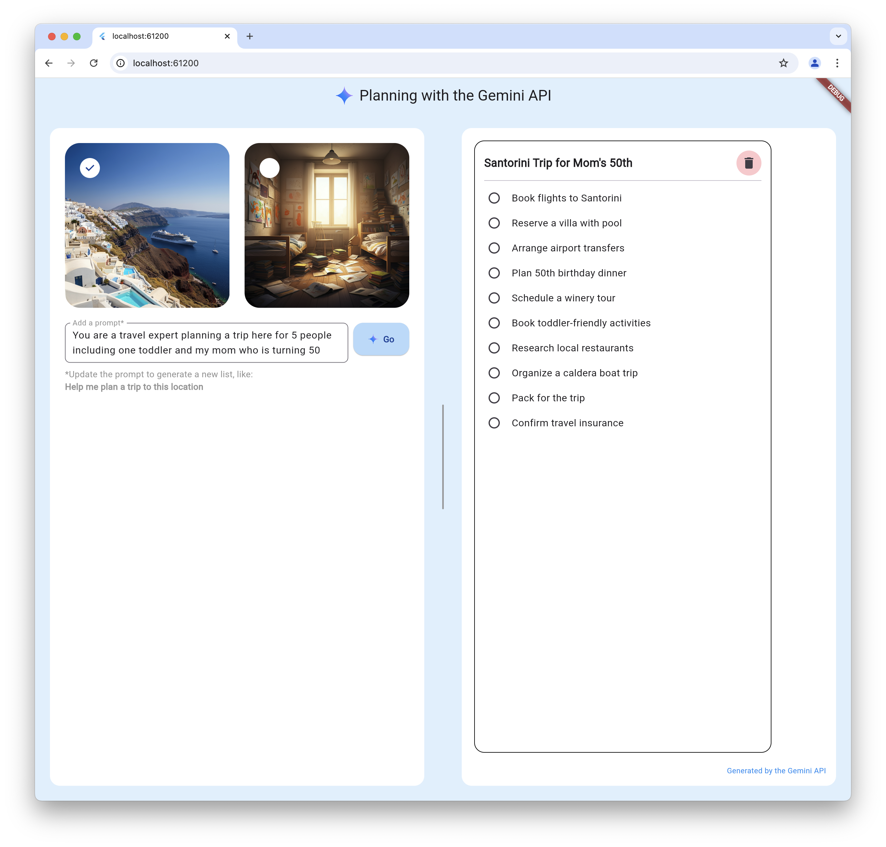

# Deprecated
This repo has been deprecated in favor of it's new home: https://github.com/FirebaseExtended/make-it-so-flutter

# Vertex AI Planner

The vertex_ai_planner repository contains a sample app showcasing the power of Firebase Vertex AI. It's written using Flutter and [the Vertex AI in Firebase Flutter package](https://pub.dev/packages/firebase_vertexai).

Inspired the [Planning with the Gemini API](https://github.com/FirebaseExtended/make-it-so-angular) sample, the planner sample app uses the LLM to combine the image you select with the prompt you enter to create a plan that you can save onto a dashboard of plans. The responsive UI makes it work well on all Firebase-support platforms: macos, web, Android and iOS.

Enjoy!

# Getting Started

This sample relies on a Firebase project, which you then initialize in your app. You can learn how to set that up with the steps described in [the Get started with the Gemini API using the Vertex AI in Firebase SDKs docs](https://firebase.google.com/docs/vertex-ai/get-started?platform=flutter).

# Usage

To use planner, you're first asked to select an image and enter a prompt (a sample prompt for each image is provided for you):



Pressing the Go button yields a plan generated by the Firebase Vertex LLM:



Pressing the Save button moves the plan to the dashboard where you can interact with the items in your plan:



Once you're done with a plan, you can remove it from the dashboard with the trashcan icon in the upper right of each plan.

# Implementation details

The planner sample interacts with Vertex AI in the `_goPressed` function:

```dart
class _PlannerViewState extends State<PlannerView> {
  final _model = FirebaseVertexAI.instance.generativeModel(
    model: 'gemini-1.5-flash-002',
    generationConfig: GenerationConfig(responseMimeType: 'application/json'),
    systemInstruction: Content.text(
      '''
Keep task names short; names ideally within 7 words.

Use the following schema in your response:
{
  "title":"string",
  "subtasks":"string[]"
}

The substasks should follow logical order ''',
    ),
  );

  ...

  Future<void> _goPressed() async {
    setState(() {
      _isGenerating = true;
      _plan = null;
    });

    final text = _controller.text;
    final prompt = 'Generate a title and list of tasks for $text '
        'using the ${_selectedImageChoice.name}.png image provided.';

    final image = await rootBundle.load(imageAssetPath(_selectedImageChoice));
    final result = await _model.generateContent([
      Content.text(prompt),
      Content.inlineData('image/png', image.buffer.asUint8List()),
    ]);

    setState(() {
      final json = jsonDecode(result.text!);
      _plan = Plan.fromJson(json);
      _isGenerating = false;
    });
  }
}
```

You can see from the initialization of the Vertex model that it's been instructed to generate a list of tasks from the user's prompt and the image that the user chose. The plan -- a list of tasks and a title -- is generated in JSON according to the requested schema to make it easy for the sample app to parse. Once a plan is generated by the LLM and parsed by the app, its shown to the user and can be saved to the dashboard or not as they chooses.

# Multi-platform

This sample has been tested and works on all supported Firebase platforms: Android, iOS, web and macOS.

# Feedback

Are you having trouble with this app even after it's been configured correctly? Feel free to drop issues or, even better, PRs, into [the vertex_ai_planner repo](https://github.com/csells/vertex_ai_planner).
